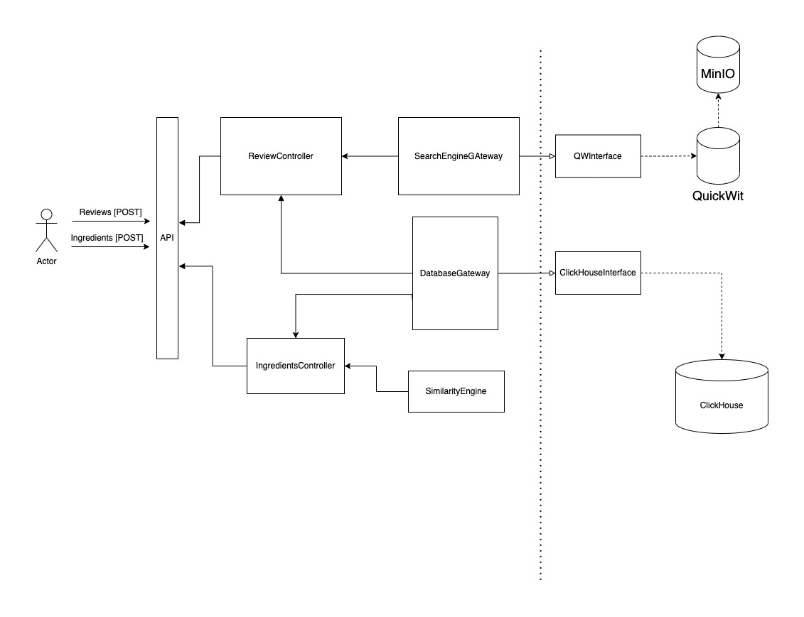
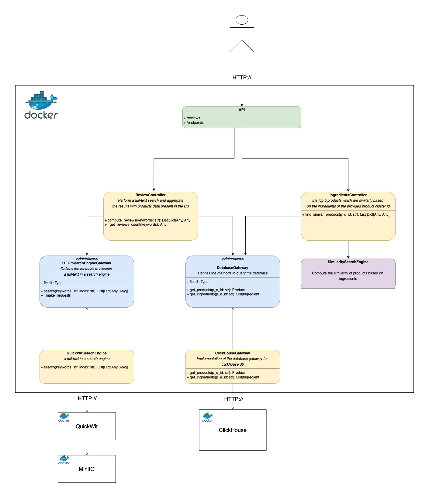

# DataZeit MLE Challenge  
  
## System Overview  
### Goal:
To develop an API that contains two endpoints:
* Review Endpoint:
The endpoint receives a text and should respond with products that include the string in the reviews.

* Ingredients Endpoint:
The endpoint receives a product cluster-id (p_c_id) and should respond with the top 5 products which are similarly based on the ingredients of the provided product cluster id.

### High-Level System Diagram

### Class Diagram

## Setting up the project

1. Clone the project repository
`git clone git@github.com:pedrocwb/datazeit-mle.git`
2. Place the `.env` file in the root directory of the project (`/datazeit-mle`)
3. Run the build script `/bin/bash build.sh`
	The build script executes the following steps:
	3.1 Create a conda environment
	3.2 Install the project dependencies
	3.3 Run the ETL scripts responsible for downloading and processing the data
	3.4 Start the application with Docker Compose. The docker compose spins up MinIO, Quickwit, ClickHouse and the Datazeit API. 

## Application Logs

The application logs will all be recorded in the file `datazeit-api.log` saved in the project root directory.

## Application Improvements

Due to time constraints, the current application presents some performance issues that should be addressed if we ever want to deploy this project into a production environment. 

- The current state of full-text search on QuickWit is slow. To improve the search performance, we can work on exposing the QuickWit REST endpoint to stream the attributes that match a search query and integrate ClickHouse to deal with the queries.
- When executing the similarity search, the application fetches all products and ingredients data to perform the data processing. To speed up this routine, one could work on processing the table joins and aggregation as much as possible on the DB side. Also, refactor the data processing methods to work in a distributed environment powered by libraries such as Dask. 
- In the application build phase, we download the data files, transform them to JSON and finally perform one-time ingestion as the initial load for QuickWit. Ideally, we would implement a message queue in production environments to feed data into the system continuously. 
- The application contains a couple of tests, but increasing the test coverage is essential to ensure system quality in production environments.  